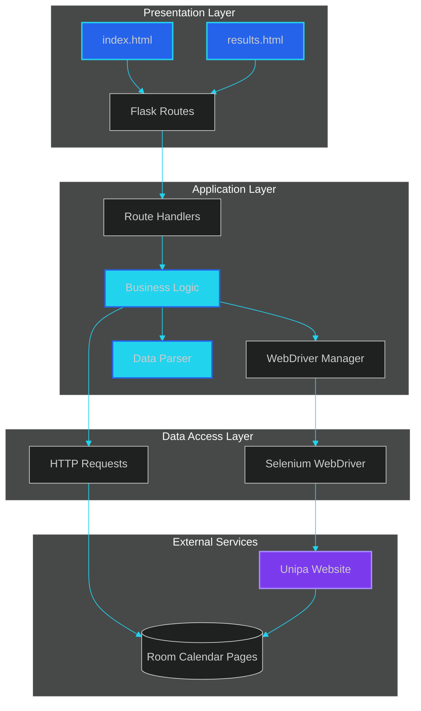
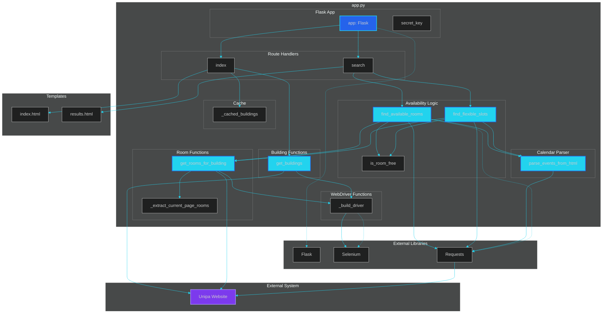
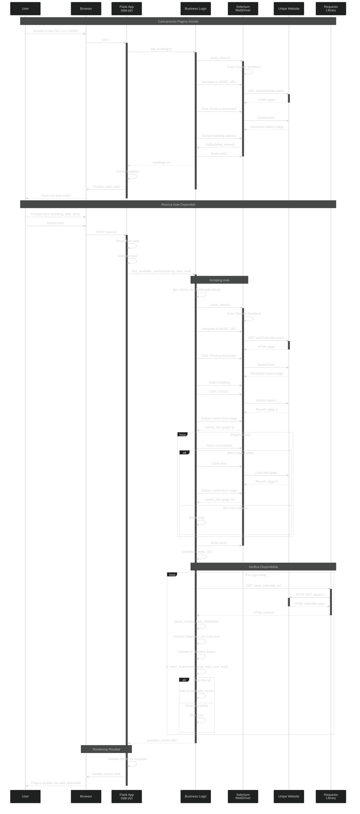

# Diagrammi Mermaid - UnipaTool

Questa pagina contiene tutti i diagrammi progettuali in formato Mermaid, che possono essere visualizzati direttamente su GitHub, GitLab, o in qualsiasi editor che supporta Mermaid.

## 1. Architecture Diagram

Diagramma dell'architettura a layer del sistema.

## 2. Components Diagram

Diagramma dei componenti con moduli e funzioni principali.

## 3. Sequence Diagram

Diagramma di sequenza che mostra il flusso completo di interazione.

## 4. Data Flow Diagram

Diagramma del flusso dati che mostra la trasformazione dei dati attraverso il sistema.

```mermaid
%%{init: {'theme':'dark', 'themeVariables': { 'primaryColor':'#2563eb', 'primaryTextColor':'#fff', 'primaryBorderColor':'#22d3ee', 'lineColor':'#22d3ee', 'secondaryColor':'#111827', 'tertiaryColor':'#0b1220'}}}%%
flowchart TD
    Start([User Input]) --> ParseInput[Parse Input]
    
    ParseInput --> UserStart[user_start = datetime<br/>user_end = datetime]
    
    UserStart --> CheckCache{get_buildings?}
    
    CheckCache -->|First load| Scrape[Scrape Unipa Website]
    CheckCache -->|Cached| UseCache[Use Cached Buildings]
    
    Scrape --> ExtractBuildings[Extract Building Options]
    ExtractBuildings --> CacheBuildings[Cache Buildings List]
    CacheBuildings --> BuildingsList[List str buildings]
    UseCache --> BuildingsList
    
    BuildingsList --> GetRooms[get_rooms_for_building building]
    
    GetRooms --> InitSelenium[Initialize Selenium WebDriver]
    InitSelenium --> Navigate[Navigate to BASE_URL]
    Navigate --> ClickAdvanced[Click Ricerca Avanzata]
    ClickAdvanced --> SelectBuilding[Select Building]
    SelectBuilding --> ClickSearch[Click Cerca]
    
    ClickSearch --> ExtractPage1[Extract Rooms from Page 1]
    
    ExtractPage1 --> CheckPages{More pages?}
    CheckPages -->|Yes| ExtractCurrent[Extract Current Page Rooms]
    ExtractCurrent --> AddToDict[Add to rooms_dict]
    AddToDict --> CheckPages
    CheckPages -->|No| RoomsDict[Dict str, Tuple str, str<br/>rooms_dict]
    
    RoomsDict --> SearchMode{Search Mode?}
    
    SearchMode -->|Exact Time| FindAvailable[find_available_rooms]
    SearchMode -->|Flexible Slots| FindFlexible[find_flexible_slots]
    
    FindAvailable --> LoopRooms1[For each room]
    LoopRooms1 --> GET1[GET room calendar URL]
    GET1 --> HTML1[HTML Response]
    HTML1 --> Parse1[parse_events_from_html html]
    Parse1 --> Events1[List Tuple datetime, datetime<br/>events]
    Events1 --> IsFree[is_room_free events, user_start, user_end]
    IsFree --> FreeCheck{Free?}
    FreeCheck -->|Yes| AddAvailable[Add to available_rooms]
    FreeCheck -->|No| SkipRoom1[Skip room]
    AddAvailable --> NextRoom1{More rooms?}
    SkipRoom1 --> NextRoom1
    NextRoom1 -->|Yes| LoopRooms1
    NextRoom1 -->|No| AvailableDict[Dict str, Tuple str, str<br/>available_rooms]
    
    FindFlexible --> LoopRooms2[For each room]
    LoopRooms2 --> GET2[GET room calendar URL]
    GET2 --> HTML2[HTML Response]
    HTML2 --> Parse2[parse_events_from_html html]
    Parse2 --> Events2[List Tuple datetime, datetime<br/>events]
    Events2 --> FindSlots[Find Free Slots<br/>Scan range with duration]
    FindSlots --> SlotsCheck{Slots found?}
    SlotsCheck -->|Yes| AddSlots[Add room with slots]
    SlotsCheck -->|No| SkipRoom2[Skip room]
    AddSlots --> FreeSlots[List Tuple datetime, datetime<br/>free_slots]
    FreeSlots --> NextRoom2{More rooms?}
    SkipRoom2 --> NextRoom2
    NextRoom2 -->|Yes| LoopRooms2
    NextRoom2 -->|No| FlexibleDict[Dict str, Tuple str, str, List<br/>results]
    
    AvailableDict --> FormatResults[Format Results for Template]
    FlexibleDict --> FormatResults
    
    FormatResults --> Render[Render results.html]
    Render --> Display([Display Results to User])
    
    style Start fill:#2563eb,stroke:#22d3ee,stroke-width:3px
    style Display fill:#2563eb,stroke:#22d3ee,stroke-width:3px
    style GetRooms fill:#22d3ee,stroke:#2563eb,stroke-width:2px
    style FindAvailable fill:#22d3ee,stroke:#2563eb,stroke-width:2px
    style FindFlexible fill:#22d3ee,stroke:#2563eb,stroke-width:2px
    style Parse1 fill:#7c3aed,stroke:#a78bfa,stroke-width:2px
    style Parse2 fill:#7c3aed,stroke:#a78bfa,stroke-width:2px
    style IsFree fill:#7c3aed,stroke:#a78bfa,stroke-width:2px
```

## Come Visualizzare

I diagrammi Mermaid possono essere visualizzati:

1. **Su GitHub/GitLab**: I file `.md` con blocchi `mermaid` vengono renderizzati automaticamente
2. **Online**: [Mermaid Live Editor](https://mermaid.live/)
3. **VS Code**: Con l'estensione "Markdown Preview Mermaid Support"
4. **Altri editor**: Molti editor moderni supportano Mermaid nativamente

I file `.mmd` possono essere aperti direttamente in [Mermaid Live Editor](https://mermaid.live/) per una visualizzazione interattiva.

